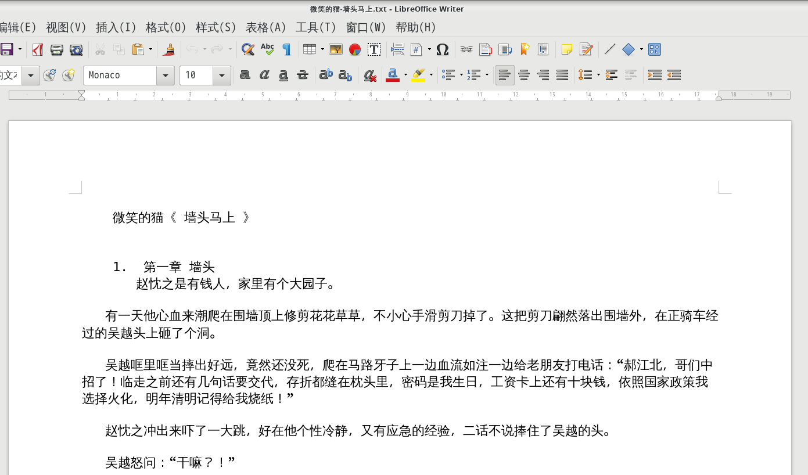

# get_jjwxc_vip
将jjwxc账号上已购买的VIP文章存为本地TXT

# 安装

以debian环境为例

    $ apt-get install firefox
    $ cpanm -n Novel::Robot
    $ cpanm -n Encode::Locale

# 用法

    $ perl get_jjwxc_vip.pl [cookie_file/cookie_string] [novelid]

按 作者-书名.txt 格式保存小说，以 [微笑的猫《墙头马上》](http://m.jjwxc.net/book2/217747?more=0&whole=1) 为例:

    $ perl get_jjwxc_vip.pl ~/.mozilla/firefox/a1xxxxxx.default/cookies.sqlite 217747

或者

    $ perl get_jjwxc_vip_raw.pl ~/.mozilla/firefox/a1xxxxxx.default/cookies.sqlite 217747 | tee sample.log

下载日志参考 [sample.log](sample.log)

